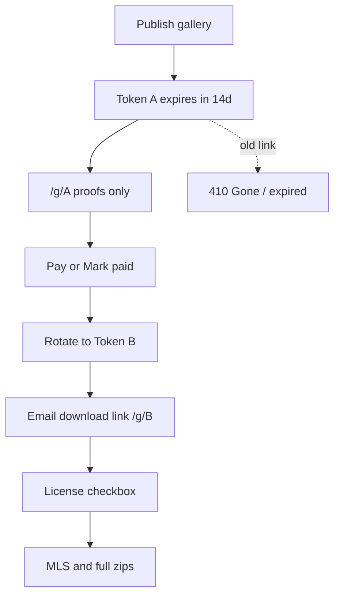

# Gallery token security (option B, 14-day expiry)

## Decisions locked

- **B**: On unlock/payment, **rotate** `publicToken`. Old proofing URL stops working; agent gets a **new** download link by email.
- **Expiry**: **14 days** from publish (proofing) and **14 days** from unlock (download token). Photographer can refresh/extend.
- Region context: Canada-first; token links remain the access model (not email-login walls).

## Answers to infrastructure questions

- **Invoices / payouts:** Photographers **connect their own Stripe Connect accounts**. Gallery Checkout charges the agent and pays the studio via Connect (platform application fee). SaaS subscription is separate platform billing. We do **not** act as the photographer’s invoicing AR system beyond Stripe-hosted Checkout receipts.
- **Watermark engine:** **Yes — already in product.** Unpurchased previews use burned-in proof watermarks (`lib/media-process.ts`); this plan also closes the unpaid `?v=web` scrape hole so clean files are not reachable from the network tab.

## Gaps today

- Media API allows unpaid `?v=web` (clean ~1600px) — scrape hole in [`app/api/g/[token]/media/[assetId]/route.ts`](app/api/g/[token]/media/[assetId]/route.ts).
- Galleries have `revokedAt` but **no** `expiresAt`; same token survives unlock forever ([`unlockGallery`](lib/galleries.ts)).
- No on-page copyright disclaimer; ToS license text is thin ([`app/terms/page.tsx`](app/terms/page.tsx)).
- No click-through license before zip/per-file download.
- ToS missing MLS indemnification, True Picture / misrepresentation, and explicit no-liability for lost commissions / downtime.

## 1. Close the unpaid scrape hole

In media + download routes:

- If **not** unlocked: only `v=proof` (and no zip). Reject `web` / `mls` / `full` with 402.
- If unlocked: allow `web` / `mls` / `full` / zip as today.
- Apply the same check in [`app/api/g/[token]/download/route.ts`](app/api/g/[token]/download/route.ts).

## 2. Schema: expiry + license acceptance

Add to `galleries` (Drizzle + SQL migrate for Neon):

- `expires_at` text null — ISO; null = not published yet or revoked
- `license_accepted_at` text null — set when agent accepts Limited Marketing License

Keep using `public_token` as the single live token (rotate in place on unlock).

## 3. Publish sets 14-day proofing window

When gallery is published / link first shared to agent (existing publish action in delivery flow):

- Set `expires_at = now + 14 days` if not already set.
- `getGalleryByToken` / gallery page / media APIs: if `expires_at < now` or `revokedAt`, return 404/410 with a short “link expired — ask your photographer for a new link” page.

Admin: **Refresh link** button → new `publicToken` + `expires_at = now + 14d` (works for proofing or post-unlock).

## 4. Unlock rotates token and emails agent

Change [`unlockGallery`](lib/galleries.ts) (Stripe webhook, stub unlock, Mark paid):

1. Generate new `publicToken`.
2. Set `state = unlocked`, `unlockedAt`, `expires_at = now + 14d`, clear `license_accepted_at`.
3. Return new token.
4. Agent email ([`lib/email.ts`](lib/email.ts) / [`lib/order-notify.ts`](lib/order-notify.ts)): subject like “Downloads ready” with **only** the new `/g/{newToken}` URL. State that the previous preview link no longer works.
5. Stripe success return URL must use the **new** token after unlock (update checkout success path / `confirmCheckoutSessionForGallery` so the browser lands on `/g/{newToken}?paid=1`).

Old token lookups fail (token no longer in DB) — no special “invalidate” row needed.

Manual e-transfer unlock in admin board: same rotate + email.

## 5. Proofing page: disclaimer + data minimization

On [`components/public-gallery.tsx`](components/public-gallery.tsx) (locked state):

- Short copyright banner, e.g. *“© Photographer. Watermarked proofs for review only. This link is for the booking agent — do not publish or share with other brokerages. Screenshots are not licensed for MLS.”*
- Keep page to: address (needed for the job), proofs, price, checkout. Do **not** add homeowner name, gate codes, or billing details (audit page + emails).

## 6. Download: click-through Limited Marketing License

When unlocked, before showing zip / per-image MLS/Full links:

- Checkbox: accept Limited Marketing License (active listing marketing only; no resale/transfer/reuse after listing expires / new listing agent; agent is responsible for MLS license terms).
- Persist `license_accepted_at` via `POST /api/g/[token]/license`.
- Download API returns 403 until accepted (or accept in same session then proceed).

## 7. Platform ToS — industry liability defenses

Expand [`app/terms/page.tsx`](app/terms/page.tsx) (product copy only; recommend lawyer review before treating as final):

1. **Copyright** — Photographer retains underlying copyright in uploaded media.
2. **Limited marketing license** — Default agent license is for marketing the active listing / their services; not perpetual MLS redistribution unless the studio grants it in writing.
3. **MLS / distribution indemnification** — If an agent uploads or submits media from the platform into an MLS or other system that demands a perpetual/worldwide license, the agent **certifies** they have obtained all necessary rights from the photographer; agent **indemnifies** the platform (and studios as software users) for claims arising from that distribution.
4. **Token / link-sharing** — Gallery URLs are secret credentials intended for the booking/purchasing agent; platform is **not liable** for third-party misuse after an agent shares their link.
5. **True Picture / alterations** — Platform tools (editing, future staging/AI, or external exports) are for legitimate aesthetic delivery; users assume **all regulatory liability** for structural misrepresentation of a property (removing damage, inventing features, deceptive AI edits). Platform does not warrant MLS/regulatory compliance of altered images.
6. **Limitation of liability / uptime** — Service provided as-is; aim for high availability but **no liability** for lost real-estate commissions, failed showings, or business interruption from downtime, expired tokens, or delivery delays.
7. **Token expiry** — Links expire; studios can refresh from admin.

## Files (primary)

- [`lib/galleries.ts`](lib/galleries.ts) — expiry checks, rotate on unlock, refresh helper, license accept
- [`lib/db/schema.ts`](lib/db/schema.ts) / [`schema.pg.ts`](lib/db/schema.pg.ts) + migrate SQL
- [`app/api/g/[token]/media/...`](app/api/g/[token]/media/[assetId]/route.ts), [`download`](app/api/g/[token]/download/route.ts), new `license` route
- [`app/g/[token]/page.tsx`](app/g/[token]/page.tsx), [`components/public-gallery.tsx`](components/public-gallery.tsx)
- [`lib/email.ts`](lib/email.ts), [`lib/order-notify.ts`](lib/order-notify.ts), [`lib/stripe.ts`](lib/stripe.ts)
- [`components/admin-order-board.tsx`](components/admin-order-board.tsx) — Refresh link + copy that unlock emails a new URL
- [`app/terms/page.tsx`](app/terms/page.tsx)

## Out of scope (this plan)

- Agent email/password login wall
- EXIF/GPS strip, virtually-staged media tags, AI staging product
- **Automated booking retainers / non-refundable deposits** at book time (booking flow has no deposit Checkout today — separate feature)
- Changing Stripe Connect / PCI model (already Checkout + Connect; no card storage)
