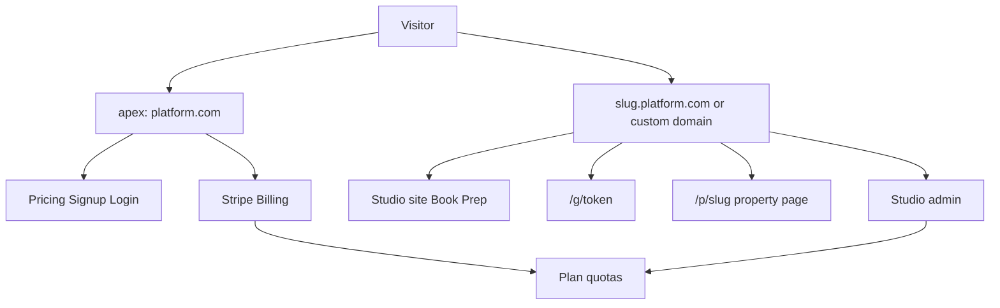

# Photographer SaaS (Aryeo-style)

The product already has the studio operating system (white-label site, booking, gated galleries, photographer auth, Connect stubs). What it does **not** have is a **platform**: the root URL still resolves to Eric, there is no photographer subscription, and Aryeo’s agent-facing extras (listing sites, automation, teams) are unbuilt.

**Eric Guan Photography stays tenant #1** at `ericguan.{PLATFORM_ROOT_DOMAIN}` (or a custom domain). The apex host becomes the SaaS.

Explicit non-goals (unchanged from [PLATFORM-PLAN.md](PLATFORM-PLAN.md)): Zillow Showcase, 3D Home, national staffing.

---

## Pricing (match Aryeo Pro)

USD platform subscriptions via **Stripe Billing** (separate from Stripe Connect, which still pays studios when agents unlock galleries).

- **Trial:** 14 days of Starter, then paywall on new listings / uploads.
- **Starter — $49/mo:** 100 listings/year, 1 seat, white-label site, booking, gated galleries. Subdomain only.
- **Growth — $99/mo:** 250 listings/year, 3 seats, custom domain, property pages.
- **Studio — $179/mo:** 500 listings/year, 5 seats, share kit, listing reports, in-gallery upsells.

A listing counts when an order is created (booking) or a gallery is opened for delivery. Seats = `memberships` rows. Storage stays on the existing quota in [`lib/quotas.ts`](lib/quotas.ts), scaled per plan.

No perpetual free Lite in v1 (abuse magnet). Can add later.

Env: `STRIPE_PRICE_STARTER`, `STRIPE_PRICE_GROWTH`, `STRIPE_PRICE_STUDIO`. Create those Price IDs in Stripe (monthly, USD).

---

## Wave 1 — Platform surface + subscriptions (build first)

This is the slice that stops the app from being “Eric’s personal page.”

### Host split

Today [`lib/tenants.ts`](lib/tenants.ts) `getTenantByHost()` returns Eric when the host is apex/`localhost`. [`proxy.ts`](proxy.ts) only sets tenant headers for known slugs.

Change:

- Apex / `www` / `localhost` → **platform host** (`x-platform-host: 1`). `getRequestTenant()` returns `null`.
- `{slug}.{PLATFORM_ROOT_DOMAIN}` or `tenants.domain` → studio tenant (unchanged).
- Local: `localhost:3000` = SaaS; `ericguan.localhost:3000` and `demo.localhost:3000` = studios (Chrome treats `*.localhost` as loopback).
- Photographer session cookie: `domain=.{PLATFORM_ROOT_DOMAIN}` in production so login on apex works on studio hosts. Omit domain on localhost.

### Route branching

Same paths, different host — no separate app:

| Path | Apex (platform) | Tenant host |
|---|---|---|
| `/` | SaaS marketing | Studio home ([`app/page.tsx`](app/page.tsx)) |
| `/pricing` | $49 / $99 / $179 | Studio packages |
| `/signup` `/login` | Photographer auth | Redirect to apex or keep |
| `/book` `/prep` `/g/*` | 404 | Existing tenant flows |
| `/admin` | Redirect to active studio host | Existing board |

[`app/layout.tsx`](app/layout.tsx) must not call `themeStyle(ericGuan)` on the apex. Platform gets its own tokens + `PLATFORM_NAME` metadata. [`app/sitemap.ts`](app/sitemap.ts) / [`app/robots.ts`](app/robots.ts) split similarly.

New/updated UI: platform home (for photographers, not agents), platform pricing, login (reuse [`components/signup-form.tsx`](components/signup-form.tsx) pattern), post-signup onboarding already at [`/onboarding`](app/onboarding/page.tsx). After onboarding, send them to Checkout or a “start trial” Billing session, then `{slug}` admin.

### Billing data + Stripe

Extend [`lib/db/schema.ts`](lib/db/schema.ts) + SQLite `ensureSchema` in [`lib/db/index.ts`](lib/db/index.ts):

- `tenants`: `stripeCustomerId`, `plan` (`trial` \| `starter` \| `growth` \| `studio`), `subscriptionStatus`, `stripeSubscriptionId`, `trialEndsAt`, `listingQuotaAnnual`, `seatsQuota`, `listingsUsedYear`
- `billing_events` (audit: webhook types, Stripe ids)

New [`lib/billing.ts`](lib/billing.ts):

- `assertCanCreateListing(tenantId)` / `assertCanInviteSeat(tenantId)`
- `createSubscriptionCheckout({ tenantId, priceId })` — Stripe Checkout `mode: "subscription"` + trial
- `createBillingPortalSession(tenantId)`
- Entitlement helpers: `hasCustomDomain`, `hasPropertyPages`, `hasShareKit`

Wire [`app/api/stripe/webhook/route.ts`](app/api/stripe/webhook/route.ts) for `customer.subscription.*` and `invoice.paid` **in addition to** existing gallery `checkout.session.completed`. Distinguish with session metadata `kind: gallery | subscription`.

Admin: billing card on [`components/studio-settings-panel.tsx`](components/studio-settings-panel.tsx) (plan, usage, Upgrade / Manage portal). Gate custom-domain save behind Growth+.

Hook listing quota in [`lib/orders.ts`](lib/orders.ts) `createBooking` and admin upload/delivery routes.

### Dogfood leftovers to fix in this wave

Onboarding currently clones Eric’s packages, gallery, and Montréal copy ([`lib/tenant-store.ts`](lib/tenant-store.ts) `createTenantFromOnboarding`). New studios should get generic placeholder packages + empty portfolio.

[`lib/service-area.ts`](lib/service-area.ts) is hardcoded Greater Montréal FSAs. Move allowed prefixes (or a “no gate” flag) onto the tenant record / settings so a second photographer can actually take bookings.

---

## Wave 2 — Property websites + share kit

Aryeo’s agent-forwarding surface. Public on the **tenant host** only.

- New `listing_pages` table: `tenantId`, `orderId`, `slug`, `brandMode`, `publishedAt`, agent fields, map lat/lng (optional).
- Auto-create/publish when an order hits `delivered` (reuse gallery media).
- Public route [`app/p/[slug]/page.tsx`](app/p/[slug]/page.tsx): hero, address, gallery, agent card, branded/unbranded (`?brand=off`). OG via `next/og`.
- Map: OSM embed (no paid Mapbox).
- Share kit (Studio plan): IG 1:1 + Story 9:16 crops from web derivatives, Facebook crop, one-pager PDF (`pdf-lib`), short caption copy. Admin action on the order board.

Growth+ entitlement; Starter can keep using `/g/[token]` only.

---

## Wave 3 — Automation + retention

Extend [`lib/email.ts`](lib/email.ts) (Resend or console stub). Fire from order status mutations in [`app/api/admin/orders/[id]/route.ts`](app/api/admin/orders/[id]/route.ts) and gallery unlock:

- Requested / confirmed / day-before (prep link) / delivered + pay CTA / paid thank-you
- `FROM` must be platform or tenant-verified; default `EMAIL_FROM` is still Eric’s — switch to `PLATFORM_EMAIL_FROM` with optional per-tenant override

Cron: `app/api/cron/reminders/route.ts` protected by `CRON_SECRET` (Cloudflare Cron later). Track gallery `views` / `downloads` on existing media routes; Studio plan gets a simple report page agents can open from the listing page.

In-gallery upsells (Studio): extra line items on Checkout (`price_data`) for add-ons already on the tenant package list.

---

## Wave 4 — Teams + legal + production harden

- Email invite → accept membership; enforce `seatsQuota`; keep `owner` / `editor`.
- Platform legal: `/terms`, `/privacy`, media license defaults.
- Postgres + RLS before inviting an external paying studio ([PLATFORM-PLAN.md](PLATFORM-PLAN.md) still-later list).
- Signed R2 (drop local mirror) when the second live tenant has real media.
- Isolation tests: extend [`scripts/isolation-check.ts`](scripts/isolation-check.ts) for billing quotas and listing-page tenant scope.

---

## Implementation order after approval

Wave 1 is the first coding pass (host split, platform pages, Stripe subscriptions, quota gates, generic onboarding, tenant service area). Waves 2–4 follow in order; each is shippable on its own.

Product name stays env-driven (`PLATFORM_NAME`, default a placeholder until you brand it). Update [PLATFORM-PLAN.md](PLATFORM-PLAN.md) status, pricing thesis, and decisions log to match this subscription model.
