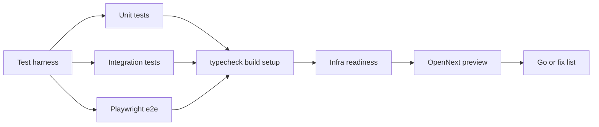

# Pre-Workers-Paid full check (+ tests)

Goal: stand up a real test suite, then verify Studiofront is ready **before** enabling Workers Paid and before `npm run deploy`. No production deploy in this pass.

Today there are **zero** `*.test.ts` / `*.spec.ts` files. Playwright is only used for PDF export ([`export-slides-pdf.mjs`](export-slides-pdf.mjs)). Isolation is a one-off script ([`scripts/isolation-check.ts`](scripts/isolation-check.ts)). This plan adds the missing layer first, then runs it as a hard gate.

## A. Test harness (new)

**Stack (concrete choices):**

| Layer                     | Tool                                                                        | Why                                                                                 |
| ------------------------- | --------------------------------------------------------------------------- | ----------------------------------------------------------------------------------- |
| Unit + API/DB integration | **Vitest**                                                                  | Fast, TS-native, works with Next path aliases                                       |
| Browser e2e               | **`@playwright/test`**                                                      | Already have `playwright` dep; proper test runner for host-based multi-tenant flows |
| DB                        | **Temp SQLite** (`DATABASE_PATH` under `os.tmpdir()`, `DATABASE_URL` unset) | Matches local seed path; no Neon needed for CI-like runs                            |

**Add:**

- `vitest.config.ts` — `resolve.alias` `@` → repo root; `environment: "node"`; include `tests/**/*.test.ts`
- `playwright.config.ts` — `webServer: npm run dev`, baseURL `http://localhost:3000`, projects for Chromium only
- `tests/helpers/db.ts` — create isolated SQLite file, call `getDb()` / seed, teardown
- `tests/helpers/http.ts` — thin `Request` helpers for calling route handlers or `fetch` against `next start`/`dev`
- Scripts in [`package.json`](package.json):
  - `"test": "vitest run"`
  - `"test:watch": "vitest"`
  - `"test:e2e": "playwright test"`
  - `"test:all": "vitest run && playwright test"`

Do **not** mock the whole DB for integration tests — use real SQLite + existing Drizzle layer.

## B. Unit tests (`tests/unit/*.test.ts`)

Pure / near-pure modules only (no network):

| Module                                                                                            | Cases                                                                  |
| ------------------------------------------------------------------------------------------------- | ---------------------------------------------------------------------- |
| [`lib/password-rules.ts`](lib/password-rules.ts)                                                  | length/case/number/special; `passwordIsValid` / `passwordIssues`       |
| [`lib/service-area.ts`](lib/service-area.ts)                                                      | normalize/format postal; CA/US validation; Montreal prefix gate on/off |
| [`lib/schedule.ts`](lib/schedule.ts)                                                              | HH:mm normalize/validate; open/close window edge cases                 |
| [`lib/preferred-slots.ts`](lib/preferred-slots.ts)                                                | parse/serialize preferred times; invalid input rejected                |
| [`lib/isolation.ts`](lib/isolation.ts)                                                            | `belongsToTenant` true/false                                           |
| [`lib/quotas.ts`](lib/quotas.ts) / [`lib/billing.ts`](lib/billing.ts) entitlements helpers        | plan limits, `assertCanCreateListing` logic where pure                 |
| [`lib/quoting.ts`](lib/quoting.ts)                                                                | price math / package totals if deterministic                           |
| [`lib/booking-schema.ts`](lib/booking-schema.ts) / [`lib/tenant-schema.ts`](lib/tenant-schema.ts) | zod parse success/fail fixtures                                        |
| [`lib/custom-domain.ts`](lib/custom-domain.ts)                                                    | host normalization / allowed domain checks                             |

Target: high-signal coverage of money-adjacent and tenant-safety logic, not 100% line coverage of UI.

## C. Integration tests (`tests/integration/*.test.ts`)

SQLite-backed, Vitest, seed via existing [`lib/platform-seed.ts`](lib/platform-seed.ts) path:

1. **Tenant isolation** — port [`scripts/isolation-check.ts`](scripts/isolation-check.ts) into Vitest assertions (`getOrder` / listing cross-tenant → null). Keep the script as a thin CLI wrapper or delete duplication after port.
2. **Signup + session** — hit [`app/api/auth/signup/route.ts`](app/api/auth/signup/route.ts) / login with `Request` objects; assert tenant row + cookie Set-Cookie / session verify.
3. **Booking** — POST [`app/api/book/route.ts`](app/api/book/route.ts) (or `createBooking` in [`lib/orders.ts`](lib/orders.ts) with tenant headers context) → order exists for that tenant only.
4. **Gallery unlock stub** — with `ALLOW_GALLERY_STUB_UNLOCK=1`, unlock path updates order/gallery state without Stripe.
5. **Listing pages** — create/read scoped to tenant; cross-tenant slug miss.
6. **Cron auth** — [`app/api/cron/reminders/route.ts`](app/api/cron/reminders/route.ts) rejects missing/wrong Bearer; accepts `CRON_SECRET`.

External services: stub Resend (no `RESEND_API_KEY` → console path) and Stripe (stub unlock or mock `lib/stripe.ts` only where Checkout URL is required). Do not call live Stripe/Resend in automated tests.

## D. Playwright e2e (`tests/e2e/*.spec.ts`)

Automate the former manual smoke loop:

1. Apex `http://localhost:3000` — marketing loads; `/signup` creates a unique studio slug.
2. Studio `http://{slug}.localhost:3000` — book form submits → confirmation.
3. Admin login → order visible on board.
4. Gallery token page loads; stub unlock when configured.
5. Forgot-password form submits without 500.

**Out of e2e (manual residual in §2):** real Resend inbox delivery and live Stripe Checkout redirect — confirm once manually if keys are present.

## E. Pre-deploy gates (after suite is green)

### 1. Automated quality gates

- `npm run typecheck`
- `npm run build`
- `npm run setup:check` ([scripts/setup-check.mjs](scripts/setup-check.mjs)) — prod-required misses = blockers
- `npm test` (Vitest unit + integration)
- `npm run test:e2e` (Playwright)
- `npm run isolation:check` optional once covered by Vitest; keep if useful as a one-liner

### 2. Manual residual smoke

Only gaps e2e cannot prove: Resend from-address delivery (`Studiofront <hello@studiofront.ca>`), Stripe test Checkout open. Restart `npm run dev` if from-address was just set.

### 3. Infra readiness (no deploy)

Same inventory as before ([DEPLOY.md](DEPLOY.md) / [docs/SECRETS.md](docs/SECRETS.md)):

| Service            | Verify                                                                                                            |
| ------------------ | ----------------------------------------------------------------------------------------------------------------- |
| **Neon**           | Schema + RLS; bigint migrate if needed                                                                            |
| **R2**             | Bucket `studiofront-media` + API token ready                                                                      |
| **Stripe Test**    | Prices, keys, portal, Connect                                                                                     |
| **Resend**         | Domain + `PLATFORM_EMAIL_FROM`                                                                                    |
| **Secrets**        | Uploaded vs missing; `ADMIN_PASSWORD` is seed-only legacy                                                         |
| **R2 bucket name** | `CLOUDFLARE_R2_BUCKET=studiofront-media` must be set (missing from [wrangler.jsonc](wrangler.jsonc) `vars` today) |
| **GitHub Actions** | `CRON_SECRET` post-deploy only                                                                                    |

### 4. OpenNext preview (no Workers Paid)

- `.dev.vars` from [`.dev.vars.example`](.dev.vars.example)
- `npm run preview` → Worker compiles/boots locally (~3.3 MiB). Product-loop confidence stays on Vitest/e2e + `next dev`.

### 5. Go / no-go scorecard

Pass/fail per: harness + unit + integration + e2e + typecheck/build + setup:check + infra + preview. When green: enable Workers Paid → reply **paid** → `npm run deploy` + attach `studiofront.ca` + `*.studiofront.ca`.

## Out of scope

- Workers Paid / production deploy / custom domains / live webhook / production cron
- Visual regression / full UI coverage of every admin control
- Hitting live Stripe/Resend APIs in CI

## After you approve

1. Install Vitest + `@playwright/test`, wire configs/scripts/helpers
2. Implement unit → integration → e2e suites above
3. Run full gate + infra inventory + OpenNext preview
4. Return go/no-go — no deploy until you reply **paid**
